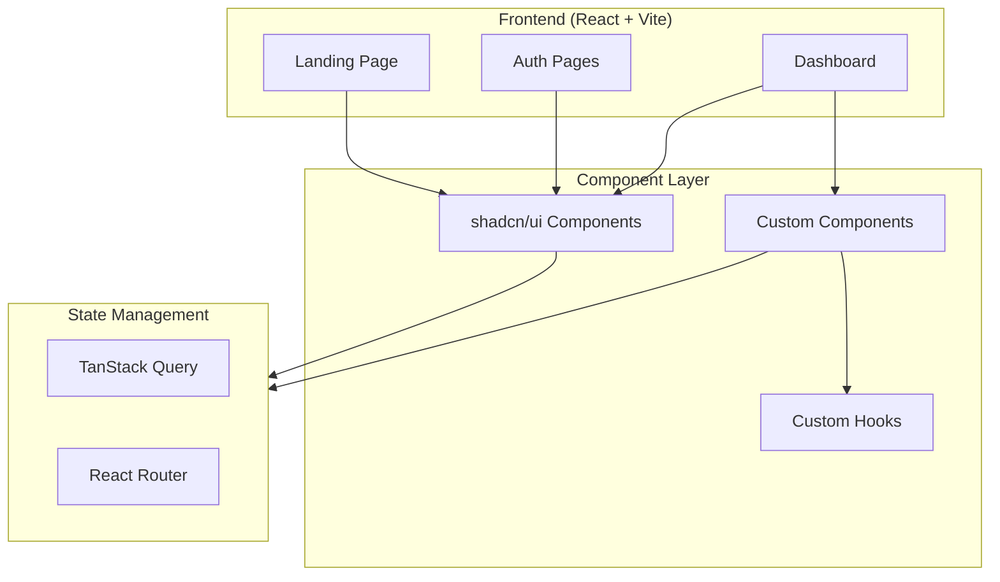
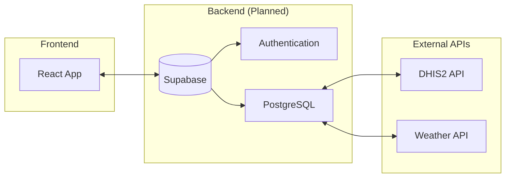

# Architecture Overview

This document describes the technical architecture of EpiPredict Kenya AI.

## System Overview



---

## Directory Structure

| Directory | Purpose |
|-----------|---------|
| `src/pages/` | Route-level components |
| `src/components/` | Reusable UI components |
| `src/components/ui/` | shadcn/ui primitive components |
| `src/components/dashboard/` | Dashboard-specific components |
| `src/hooks/` | Custom React hooks |
| `src/lib/` | Utility functions |
| `src/assets/` | Static assets (images) |

---

## Component Hierarchy

```
App
├── QueryClientProvider (TanStack Query)
├── TooltipProvider
├── Toaster (notifications)
├── Sonner (toast notifications)
└── BrowserRouter
    ├── / → Index (Landing)
    │   ├── Header
    │   ├── Hero
    │   ├── Features
    │   ├── SocialProof
    │   ├── FinalCTA
    │   └── Footer
    ├── /login → Login
    ├── /signup → Signup
    ├── /dashboard → Dashboard
    │   ├── SidebarProvider
    │   ├── DashboardSidebar
    │   ├── DashboardHeader
    │   └── StatCards
    └── /* → NotFound
```

---

## Design System

### Color Tokens

All colors are defined as HSL values in `src/index.css`:

| Token | Light | Dark | Usage |
|-------|-------|------|-------|
| `--primary` | `120 100% 20%` | `120 100% 25%` | Kenya green - CTAs |
| `--accent` | `217 91% 60%` | `217 91% 60%` | Medical blue |
| `--destructive` | `348 83% 47%` | `348 83% 47%` | Kenya red - alerts |

### Typography

Uses system fonts via Tailwind defaults. Headings use bold weights.

### Spacing

Uses Tailwind's default spacing scale with container padding of `2rem`.

---

## State Management

### TanStack Query
- Used for server state management
- Provides caching, refetching, and loading states
- Currently configured but awaiting backend integration

### React Router DOM v6
- File-based page routing
- Uses `<Link>` for navigation
- `useNavigate()` for programmatic navigation
- `useLocation()` for active route detection

---

## Form Handling

- **React Hook Form** - Form state management
- **Zod** - Schema validation
- **shadcn/ui Form components** - Accessible form elements

---

## Future Architecture (Planned)



---

## Key Patterns

### 1. Component Composition
shadcn/ui components are used as building blocks, composed into domain-specific components.

### 2. Colocated Styles
All styling uses Tailwind utility classes inline. Design tokens are in `index.css`.

### 3. Type Safety
Full TypeScript coverage with strict mode enabled.

---

## Performance Considerations

- Vite for fast HMR in development
- Code splitting via React Router lazy loading (not yet implemented)
- TanStack Query for optimistic updates and caching

---

*Last updated: January 2026*
